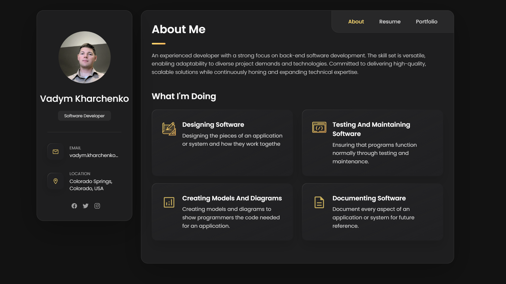

# Portfolio Website
## Vadym-0K.github.io
### Preview
<p align="center">

</p>

### Vadym-0K.github.io

This is my personal portfolio website showcasing my work as a back-end software developer. The site is designed to present my experience, skills, and current projects. I used a skeleton repo from [codewithsadee's vCard personal portfolio](https://github.com/codewithsadee/vcard-personal-portfolio.git) and modified it to fit my personal brand and style.

## Features
- **Responsive Design**: The portfolio is optimized for viewing on any device, from mobile to desktop.
- **Project Showcase**: Includes details about my projects, skills, and the technologies I specialize in.
- **Contact Information**: Visitors can reach out via email or social media links.
- **About Me Section**: Overview of my background, skills, and what I'm currently working on.

## What I Modified
- Replaced all placeholder content with my personal information, including:
  - My name, email, and location.
  - Custom description about my experience and skillset.
  - Details about the services I offer, such as software design, testing, documentation, and creating models and diagrams.
  - Updated all the icons and imagery to reflect my personal brand.
  
- Tweaked the UI/UX for a better user experience.
  
## Technologies Used
- HTML
- CSS
- JavaScript

## Installation
1. Clone this repository:
   ```bash
   git clone https://github.com/YOUR-USERNAME/YOUR-REPO-NAME.git
   ```
2. Navigate to the project folder:
   ```cd YOUR-REPO-NAME```
3. Open index.html in your browser to view the site.

## Acknowledgements
This portfolio website is based on [codewithsadee's vCard personal portfolio](https://github.com/codewithsadee/vcard-personal-portfolio.git) template. Big thanks to [codewithsadee](https://github.com/codewithsadee) for the great starting template!

## Contributing
Contributions are welcome! Feel free to fork this repository, make your changes, and submit a pull request.


## Contact
If you have any questions or suggestions, feel free to contact me at:  
**Vadym Kharchenko**  
Email: vadym.kharchenko@yahoo.com

